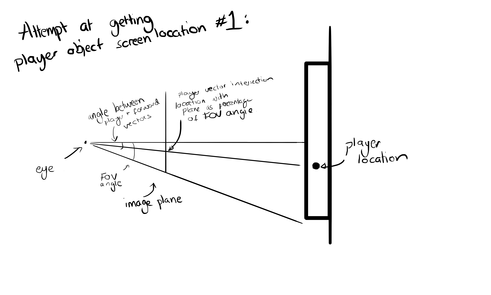
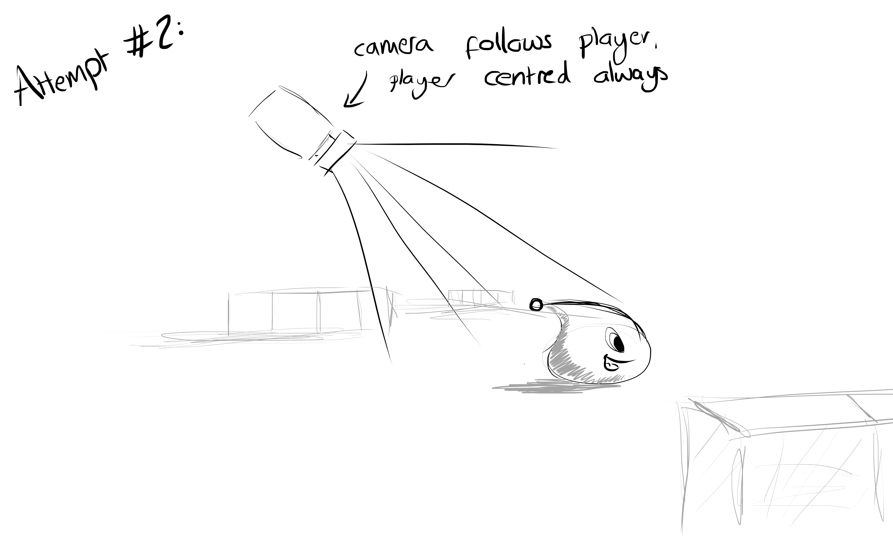
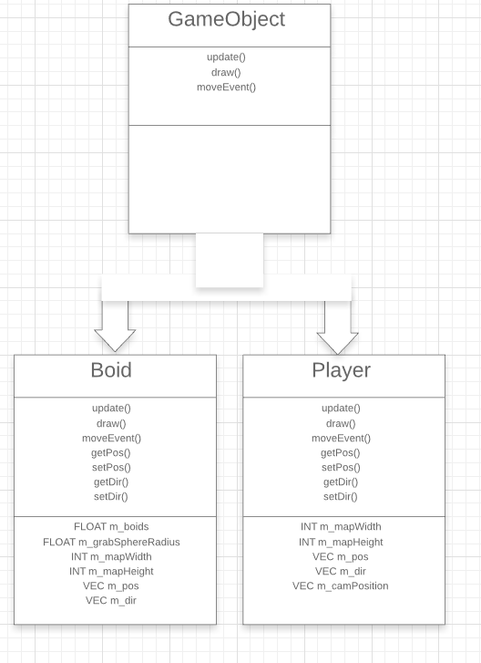
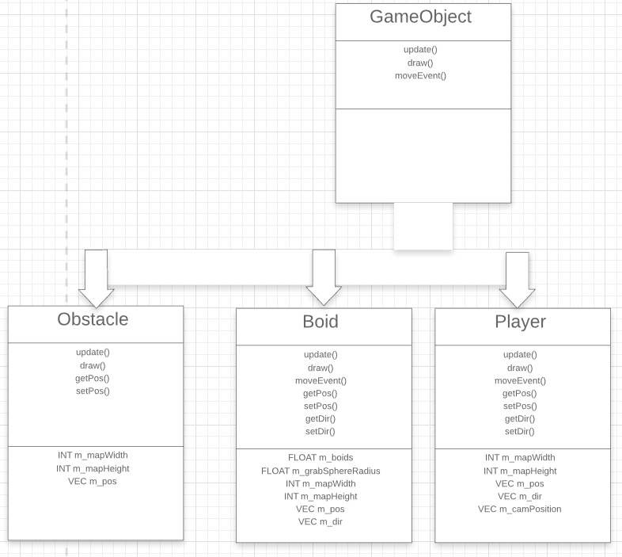

# BoidSnake
A snake style game made in C++ using the NCCA graphics library. 

# CFGAA Assignment Jacob Worgan 
## s5107963

## Project Development::

For this project, I planned to make a game featuring some form of flock simulation.

My initial idea that I began doing research for was a simple game where the player could move about a game level collecting flocking boids. For this, I looked into how flocking systems work, primarily using (Pemmaraju, 2013) as reference. 
I also planned on using a diamond-square algorithm (reference 2) to generate non-flat terrain for the boids to move around on, using the fact that the x and y coords are known and therefore also the tri on the plane the boid would be over, to get the plane height using ray-tri intersection. By using two rays, one at the front of the boid and one at the back, the boid could also then be angled to the curve of the ground plane. 

In my final project, the flock sim part stayed, but I decided not to go with a rough terrain as I wanted to instead go with a top-down view and have controls using mouse input rather than keyboard presses, with the player character following the cursor, to hopefully give smoother overall control. 

Again, I explored several options for this, starting with a fairly complicated option of going from the object-space of the player character and calculating the point on screen, and from there calculating the vector from there to the current mouse position. 

I couldn't find anything built into the NGL library, and knew OpenGL and SDL did other things, OpenGL just putting tris and points on the screen without knowledge of the object, and SDL handling the window and controls, and not knowing about the OpenGL scene. So, I had to figure out how to do the projection to 2D by hand.

I do not know if this is the most efficient way of doing this, but I tried to figure it all out using the information set up in the scene. The player object, of course, knows its location, and the scene has the camera location. So, I used maths to find the vector between the ray going through the centre of the camera projection and the ray going from the camera to the player object. Setting up the scene also required a field of view angle, so I also knew what the angle of the edges of the screen were. Then it was just about diving this angle by the pixel dimensions of the window, and then finally getting the percentage of the FOV angle of the previously calculated camera to object angle. And in theory, that should give the exact pixel the object is located at. 

Building on the work of the SDL lab sessions, I first tried implementing this and got okay results. With a bit of tweaking of values, it could have worked, but at the time the game was already starting to slow, so I considered alternatives. It was then that I thought about instead having the camera follow the player, which is always centred. That way the player location is always known, and controls are simplified as the same point on screen always gives the same movement vector, using the built in function SDL_GetMouseState(). 

This greatly simplified things, including the fact that the map could be any size and I would not have to add in any extra code to make sure all of it is in view.  

With this done, I added in a 'Boid' class, inheriting from GameObject, to handle the movement, position, and drawing of the flock Boids. In the arena class I also added in the call loops to the boids to handle the separation, allignment, and cohesion of the boids each tick. 

Using the ngl VAOPrimitives class I was also then able to import an obj model to be used in the game for the playable character. 

The code was still running slow here, but this was solved almost entirely by removing calls to std::cout. 

To further improve the code, I think using the ngl Vec2 classes more would tidy the code up a lot. I was using a separate class throughout and it ended up making some messy code, as I had to hard code every time I did things like normalisation, and there was no easy way to do maths on multiple vectors without separating things out with calls to the .x and .y of each vector. 

Finally, I also added in sphere collision detection, both used for the flocking controls to check which Boids were in range to affect the given boid, and to check for direct collisions with the player to destroy the boid. 

## Class Diagrams

This diagram shows the inheritance between the two main GamePlay objects and their parent class, the Boid and Player classes. 

This is an extention of the classes, showing further development that could be made. By having boids avoid all 'GameObject' objects in general, it could be expanded to include obstacles and gameplay hazards. 

### Bibliography

Pemmaraju, V., 2013. 3 Simple Rules of Flocking Behaviors: Alignment, Cohesion, and Separation. \[online\] envatotuts+. Available from: <https://gamedevelopment.tutsplus.com/tutorials/3-simple-rules-of-flocking-behaviors-alignment-cohesion-and-separation--gamedev-3444> [Accessed 2020-05]

Wikipedia, 2020. Diamond-square algorithm. \[online\] Available from: <https://en.wikipedia.org/wiki/Diamond-square_algorithm> [Accessed 2020-05]

The two additional models, the Doryphoros model and the Panda model, used in the project were made by me for previous units, the year 1 second semester (2019) 'Technical Arts Production' and year 2 first semester (2020) 'Real Time Graphics Systems' units respectively. 
